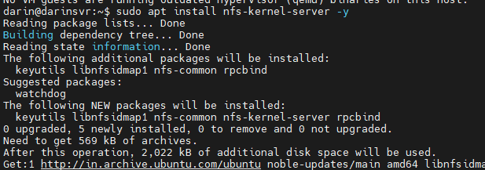
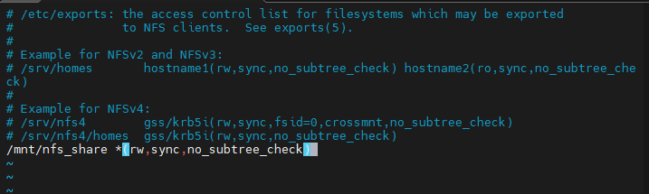
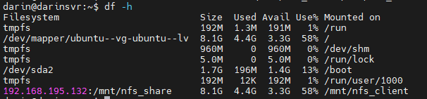
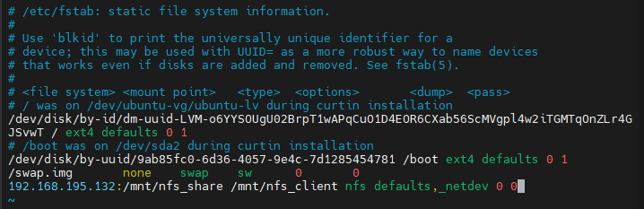

# NFS Server Setup and Client Mount Guide

## 📌 Overview
Network File System (NFS) allows you to share directories and files across systems over a network. It enables remote systems to access files as if they were stored locally.

---

## 🧠 How NFS Works
- The **NFS Server** exports a directory.
- **Clients** mount that directory.
- Communication uses **RPC (Remote Procedure Call)**.
- Default port: **2049**.

---

## 🖥️ NFS Server Setup (Linux)



### 1. Install NFS Server
```bash
sudo apt update
sudo apt install nfs-kernel-server -y
```

---

### 2. Create Shared Directory
```bash
sudo mkdir -p /mnt/nfs_share
sudo chown nobody:nogroup /mnt/nfs_share
sudo chmod 755 /mnt/nfs_share
```

> ⚠️ Avoid `777` in production. Use controlled permissions.

---

### 3. Configure Export
Edit exports file:
```bash
sudo vim /etc/exports
```


#### Example (Allow specific subnet)
```
/mnt/nfs_share 192.168.1.0/24(rw,sync,no_subtree_check)
```

#### Example (Allow single client)
```
/mnt/nfs_share 192.168.1.10(rw,sync,no_subtree_check)
```

> 📌 Note: The IP here represents **CLIENT systems**, not the NFS server.

---

### 4. Apply Export Configuration
```bash
sudo exportfs -a
```

---

### 5. Restart NFS Service
```bash
sudo systemctl restart nfs-kernel-server
```

---

### 6. Verify Export
```bash
sudo exportfs -v
```

---

## 💻 NFS Client Setup

### 1. Install NFS Client
```bash
sudo apt update
sudo apt install nfs-common -y
```

---

### 2. Create Mount Point
```bash
sudo mkdir -p /mnt/nfs_client
```

---

### 3. Mount NFS Share (Temporary)
```bash
sudo mount <SERVER_IP>:/mnt/nfs_share /mnt/nfs_client
```

---

### 4. Verify Mount
```bash
df -h
```


---

## 🔁 Permanent Mount (Auto Mount After Reboot)

### 1. Edit fstab
```bash
sudo vim /etc/fstab
```

### 2. Add Entry
```
<SERVER_IP>:/mnt/nfs_share /mnt/nfs_client nfs defaults,_netdev 0 0
```


### 3. Apply Configuration
```bash
sudo mount -a
```

> `_netdev` ensures the mount happens only after network is available.

---

## ⚙️ Mount Options Explained
- `defaults` → Standard options
- `rw` → Read & write access
- `sync` → Immediate write to disk
- `hard` → Retry if server unavailable (recommended)
- `intr` → Allow interrupt
- `_netdev` → Wait for network before mount

#### Advanced Example
```
<SERVER_IP>:/mnt/nfs_share /mnt/nfs_client nfs rw,sync,hard,intr,_netdev 0 0
```

---

## 🔒 Firewall Configuration

### Allow NFS Service
```bash
sudo ufw allow from <CLIENT_IP> to any port 2049
```

---

## 🧪 Testing

### On Client
```bash
touch /mnt/nfs_client/testfile
```

### On Server
```bash
ls /mnt/nfs_share
```

---

## ❗ Troubleshooting

### Check NFS Service
```bash
systemctl status nfs-kernel-server
```

### Check Network Connectivity
```bash
ping <SERVER_IP>
```

### List Available Shares
```bash
showmount -e <SERVER_IP>
```

### Check Logs
```bash
journalctl -xe
```

---

## 📌 Best Practices
- Restrict access using **specific IPs or subnets**
- Avoid using `*` in production
- Use proper permissions instead of `777`
- Enable firewall rules
- Use `hard` mount for stability

---

## 🎯 Example Setup

### Server (`/etc/exports`)
```
/mnt/nfs_share 192.168.1.10(rw,sync,no_subtree_check)
```

### Client (`/etc/fstab`)
```
192.168.1.5:/mnt/nfs_share /mnt/nfs_client nfs defaults,_netdev 0 0
```

---

## ✅ Summary
- Install NFS server & client
- Export directory from server
- Mount on client
- Configure `/etc/fstab` for persistence

---

🚀 Your NFS setup is now production-ready with permanent mounting!

